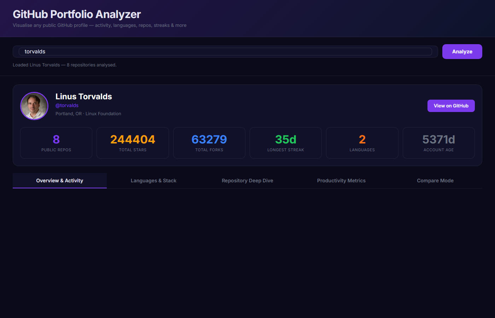
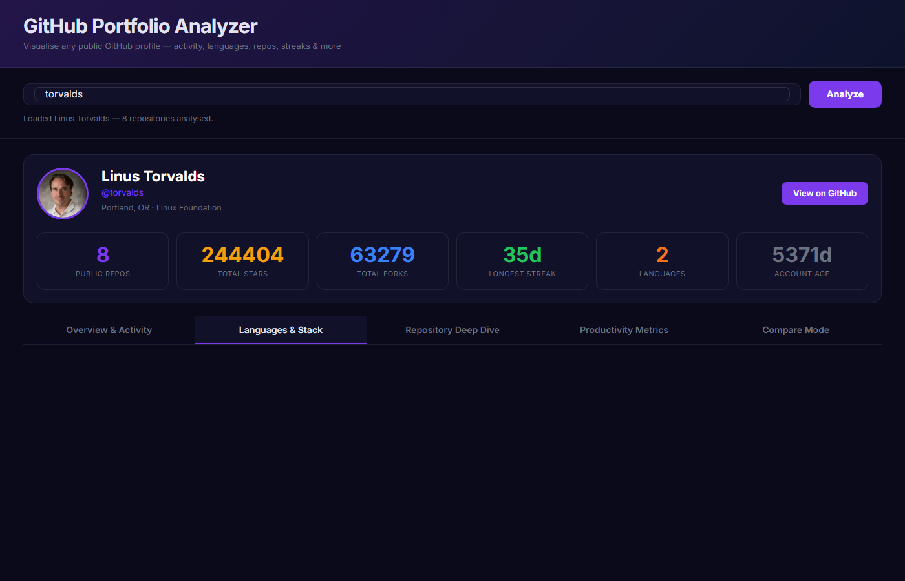
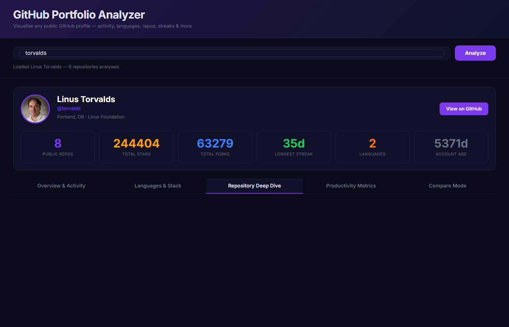
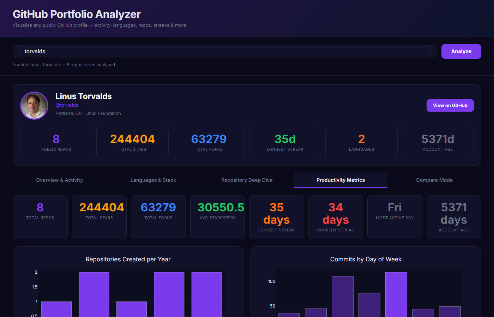
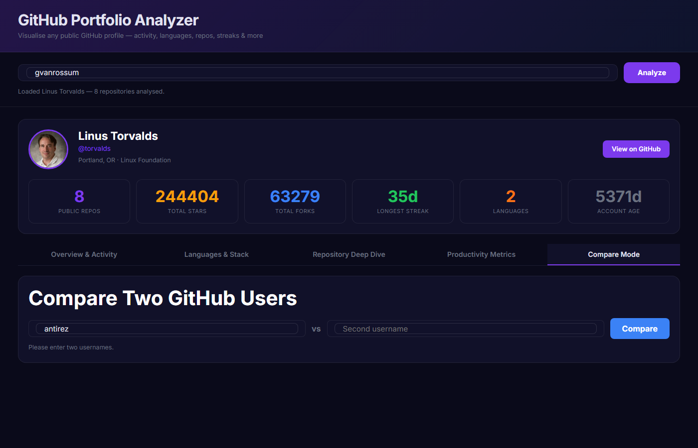

# GitHub Portfolio Analyzer

> A developer analytics dashboard that deep-dives into any GitHub profile — contribution heatmaps, language evolution, streak tracking, repo timelines, and side-by-side profile comparison. No sign-in required.


---

## Features

### Overview Tab
Full profile card (avatar, bio, location, company, followers), seven KPI chips (total repos, stars, forks, commits, account age, gists, languages used), and the GitHub-style contribution heatmap for the past 365 days.

### Activity Tab
- **Streak tracker** — current streak, longest streak, and total active days with color-coded streak boxes
- **Commits by weekday** — bar chart (Mon–Sun) showing which days are most productive
- **Commits by hour** — 24-hour heatmap revealing peak coding hours
- **Language donut** — byte-weighted breakdown of languages used across top repos
- **Repos by language** — count of repos per primary language

### Repositories Tab
- **Repo timeline scatter** — created_at vs pushed_at, sized by stars, colored by language — instantly shows project lifecycle
- **Top repos by stars** — horizontal bar chart of top 15 most-starred repos
- **Stars vs Forks** — scatter to identify repos with disproportionate community impact
- **Repos created per year** — bar chart showing career velocity over time

### Languages Tab
- **Language evolution area chart** — stacked area showing how language mix shifted year-by-year
- **Top topics word cloud** — tag bubbles across all repos, sized by frequency
- Detailed language byte table with percentage breakdown

### Compare Mode
Enter any two GitHub usernames to get:
- **Radar chart** — 6-axis comparison: Stars, Forks, Repos, Commits, Active Days, Languages
- **Side-by-side metrics table** — all key stats with delta highlighting (higher = green)

---

## Screenshots

| Overview | Activity |
|:--------:|:--------:|
|  |  |

| Repositories | Languages |
|:------------:|:---------:|
|  |  |

| Compare Mode | |
|:------------:|-|
|  | |

---

## Quick Start

```bash
git clone https://github.com/OzSpidey/github-portfolio-analyzer.git
cd github-portfolio-analyzer

pip install -r requirements.txt

# Optional: add your GitHub token for 5000 req/hr instead of 60
cp .env.example .env
# Edit .env and set GITHUB_TOKEN=ghp_...

python dashboard.py
# Open http://localhost:8054
```

Type any GitHub username (try `torvalds`, `gvanrossum`, or `antirez`) and click **Analyze**.

---

## Why a Token?

Without authentication the GitHub API allows **60 requests/hour**. A full analysis of an active user (30 repos × commits + languages) uses roughly 80–100 requests. With a token you get **5000 requests/hour** and can analyze dozens of profiles without hitting limits.

Token only needs `public_repo` read access — no write permissions needed.

---

## Architecture

```
github-portfolio-analyzer/
├── dashboard.py          # Dash app — 5 tabs, all callbacks, chart layout
├── analyzer.py           # Analysis logic — streaks, heatmaps, language evolution
├── github_client.py      # GitHub API client — caching, rate limits, pagination
├── config.py             # Colors, constants, language color map
├── assets/
│   └── dashboard.css     # Dark glassmorphism theme
├── cache/                # Auto-created; JSON cache files (1-hr TTL, gitignored)
├── .env.example          # Token config template
└── requirements.txt
```

### Data Flow

```
User types username
       ↓
GitHubClient.get_user()        → /users/{username}
GitHubClient.get_repos()       → /users/{username}/repos  (paginated)
GitHubClient.get_languages()   → /repos/{u}/{r}/languages (top 30 repos)
GitHubClient.get_commits()     → /repos/{u}/{r}/commits   (top 30 repos, 3 pages)
       ↓
analyzer.analyze_user()        → compute streaks, heatmaps, evolution, summary
       ↓
dashboard callbacks            → render all charts from result dict
```

All API responses are cached to `cache/*.json` with a 1-hour TTL. Re-analyzing the same user within an hour is instant with zero API calls.

---

## Caching Design

| What's cached | Key pattern | TTL |
|---|---|---|
| User profile | `user_{username}.json` | 1 hour |
| Repo list | `repos_{username}.json` | 1 hour |
| Language bytes | `langs_{user}_{repo}.json` | 1 hour |
| Commits | `commits_{user}_{repo}.json` | 1 hour |

Cache files are stored as plain JSON in `cache/` (gitignored). To force a fresh fetch, delete the relevant file or the entire `cache/` directory.

---

## Rate Limit Handling

`GitHubClient` implements multi-layer protection:

1. **Pre-request buffer** — if `X-RateLimit-Remaining` drops below 5, the client sleeps until `X-RateLimit-Reset`
2. **HTTP 429/503 retry** — exponential backoff (2s, 4s, 8s) up to 3 attempts
3. **Timeout retry** — 15-second per-request timeout with automatic retry
4. **1-hour cache** — drastically reduces total API calls on repeated analyses

---

## Requirements

```
dash>=2.14.0
dash-bootstrap-components>=1.4.0
plotly>=5.17.0
pandas>=2.0.0
numpy>=1.24.0,<2.0
requests>=2.31.0
python-dotenv>=1.0.0
```

---

## Related Projects

- [Fraud Detection Simulator](https://github.com/OzSpidey/fraud-detection-dashboard) — Real-time XGBoost + Isolation Forest transaction scoring
- [Customer Churn Intelligence Platform](https://github.com/OzSpidey/churn-predictor-dashboard) — SHAP-explained XGBoost churn prediction
- [Clinical Trial Intelligence Dashboard](https://github.com/OzSpidey/clinical-trial-dashboard) — Live ClinicalTrials.gov data across 8 disease areas
- [Stock Sentiment Dashboard](https://github.com/OzSpidey/stock-sentiment-dashboard) — Real-time NLP sentiment for 15 stocks

---

*Built with Plotly Dash · GitHub REST API v3 · File-based caching*
